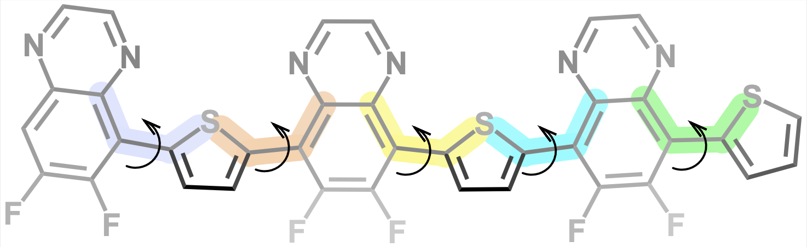
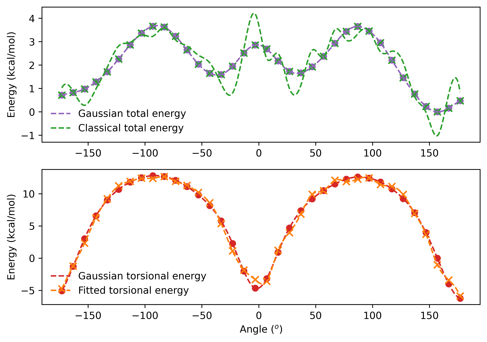
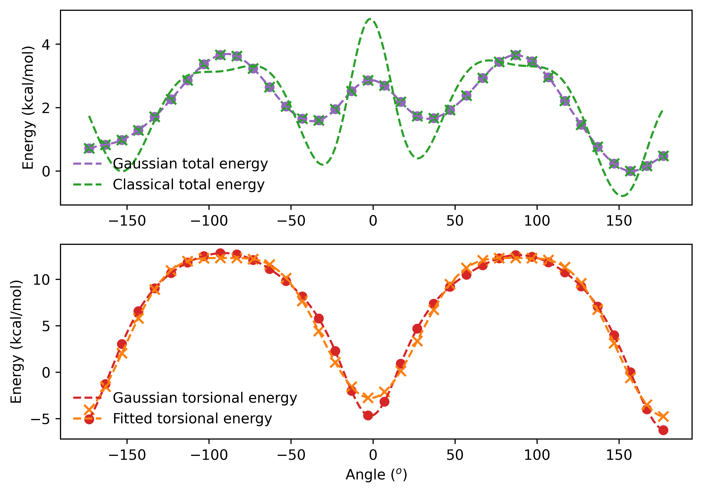
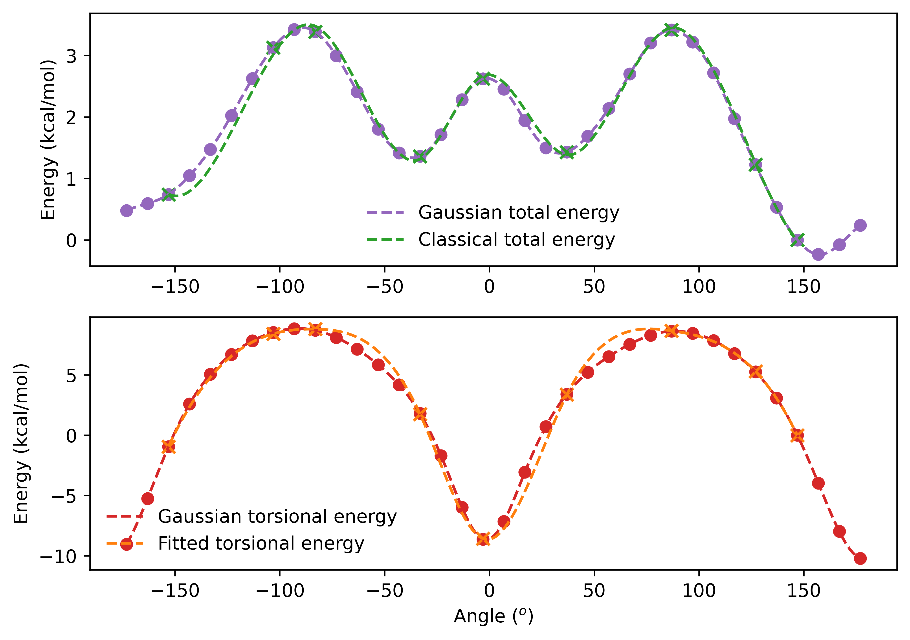

# Fitting proper torsional constants for OPLS-AA force field

This tutorial is dedicated to run the `fit_dihedral.py` script. Before following the tutorial, be sure that scripts from the [DICEtools](https://github.com/hmcezar/dicetools) library are in your `$PATH` or that `fit_dihedral.py` is inside the DICEtools directory.

## Ryckaert-Bellemans dihedral

As developed by [William L. Jorgensen et al.](https://doi.org/10.1021%2Fja00214a001), the OPLS-AA force field describes the proper torsional interaction according to the Ryckaert-Bellemans dihedral. For each proper torsional angle the energy is given by,

$$E_{RB}=\sum_{n=1}^6C_n[\cos{(\phi+\delta_n)}]^n\equiv\frac{1}{2}\sum_{n=1}^4F_n[1+(-1)^{n+1}\cos{(n\phi+\delta_n)}] \ .$$

Both forms are equivalent, but during our tests the additional flexibility with 6 coefficients ($C_n$) had a better performance in comparison to 4 coefficients ($F_n$) in the Fourier form. Therefore, the `fit_dihedral.py` considers the full expression with 6 coefficients and all $\delta_n$ phases are set to zero, as frequently done.

For this example we are going to consider [PTQ10](https://www.ossila.com/products/ptq10), a low-cost electron donor polymer. As our approach includes running a rigid scan, only the linker group from side chains are considered, avoiding atomic overlapping and overestimated energy barriers. A priori, one should include all flexible single bonds highlighted in the figure below.



Our example will illustrate the procedure for fitting the torsional constants of the dihedral highlighted in cyan, but it's the same for any other dihedral, only changing the atom indexes. Note that the other 3 dihedrals that share the same two central atoms with the cyan dihedral are also adjusted during the procedure, _i.e._, the fitting procedure includes 24 constants.

## Initial setup with DICEtools

The first part is adapted from [DICEtools tutorial](files/tutorial_dice.pdf) (unfortunately only in portuguese). With the topology and configuration files in the `.itp`, `.gro` and `.pdb` formats, we start by generating the input files for DICE. If the topology file was generated using external tools, _e.g._, by [LigParGen](https://traken.chem.yale.edu/ligpargen/) or [PolyParGen](http://polypargen.com), one should run the `reorder_ligpargen.py` script to avoid having different ordering of atoms among the files.

```
$ python $dicetools/reorder_ligpargen.py trimer_org.pdb trimer_org.gro trimer_org.itp
```

The script will generate two new files, _i.e._, `reordered_trimer_org.gro` and `reorder_trimer_org.itp`, which should be used from now on. In our case, we also want to change partial charges in the topology file, which can be done by running:

```
$python $dicetools/parse_gaussian_charges.py reordered_trimer_org.itp tri_chelpg_org.log -m chelpg
Total charge is zero.
The charges were sucessfully parsed.
```

The `tri_chelpg_org.log` is the Gaussian output file from a single-point calculation using ChelpG to compute the partial charges, and the `parse_gaussian_charges.py` code parses the partial charges, making sure that the net charge is zero in the `parsed_reordered_trimer_org.itp` file. To avoid using the wrong topology file, I recommend deleting or moving the other `.itp` files, such that:

```
$ ls 
parsed_reordered_trimer_org.itp tri_chelpg_org.log              trimer_org.pdb
reordered_trimer_org.gro        trimer_org.gro
```

Now, we can generate the DICE input files with proper partial charges by running the following:

```
$ python $dicetools/gromacs2dice.py parsed_reordered_trimer_org.itp reordered_trimer_org.gro -g -c --flexible-fragments
The files reordered_trimer_org.txt and reordered_trimer_org.dfr were successfully generated.
```

It is crucial to add the `-g` and `-c` flags because they will ensure that bonds and angles are extracted from the files provided, instead of using default OPLS-AA values. Furthermore, the `--flexible-fragments` flag will write additional data to run simulations with flexible molecules. With the DICE input files, we can generate the Gaussian input file for running the rigid torsional scan using the `plot_eff_tors.py` script:

```
$ python $dicetools/plot_eff_tors.py reordered_trimer_org.txt reordered_trimer_org.dfr 30 29 52 61 36 --gausstop top_g16.txt >> plot_eff_tors.out
```

In addition to the `.txt` and `.dfr` files, created by the previous command, one need to specify 4 atom indexes that define the dihedral angle. For the cyan angle, such atoms are indexed as `30`, `29`, `52` and `61` (this order was extracted from the proper dihedrals in the `.itp` file, but is not a requirement). The next number, `36` (`npoints`), corresponds to the amount of configurations included in the scan, such that the angle variation between two subsequent configurations is $\varphi=360/\text{npoints}$ (in degrees). The header of the Gaussian input file with the calculation details is also a requirement, and in this case is written in the `top_g16.txt`:

```
$ cat top_g16.txt
%NProcShared=20
%Mem=480gb
%chk=scan_PQx8O-T.chk
#P M06/6-311G(d,p) Integral(Grid=UltraFineGrid) SCF(Tight) SCRF=(PCM, solvent=n-Octanol)

P(Qx8O-T) trimer optimization with n-Octanol solvent

0 1
```

**_PS:_** One can also add the `--gaussbot` flag to include a footer in the input files, _e.g._, to provide custom solvent variables.  

Moreover, the `--printxyz` flag generates a `.xyz` file with each configuration, being a requirement for the further fit using `fit_dihedral.py`. Finally, the code yields energies and dipole moment for each configuration (which are stored in `plot_eff_tors.out` file) and generates several files with the `tors_30-29-52-61_*` format:

```
$ ls
parsed_reordered_trimer_org.itp tors_30-29-52-61.out            tors_30-29-52-61_total.pdf
plot_eff_tors.out               tors_30-29-52-61_dipole.pdf     tri_chelpg_org.log
reordered_trimer_org.dfr        tors_30-29-52-61_nonbonded.pdf  trimer_org.gro
reordered_trimer_org.gro        tors_30-29-52-61_rotations.xyz  trimer_org.pdb
reordered_trimer_org.txt        tors_30-29-52-61_scan.gjf
top_g16.txt                     tors_30-29-52-61_torsion.pdf
```

## Running `fit_dihedral.py`

After computing the single-point energies from the `tors_30-29-52-61_scan.gjf` Gaussian input file, we can fit the $C_n$ dihedral constants. Consider the `tors_30-29-52-61_scan.log` file as the output file, then we can run:

```
$ python $dicetools/fit_dihedral.py tors_30-29-52-61_scan.log tors_30-29-52-61_rotations.xyz parsed_reordered_trimer_org.itp reordered_trimer_org.txt reordered_trimer_org.dfr 30 29 52 61 36
```

By default, the code will run an ordinary linear regression using the least-square method, and the `LR_parsed_reordered_trimer_org.itp` file will be generated with new coefficients. An additional file named `linear_regression.png` is also provided, so we can assess the quality of the fitting procedure. In this case, we got the following:



Even though the dihedral energy is well fitted (bottom panel), the total energy end up presenting several undesired fluctuations (top panel). Additionally, when checking the fitted coefficients we can easily identify a **multicollinearity** problem:

```
$ diff LR_parsed_reordered_trimer_org.itp parsed_reordered_trimer_org.itp
1,3d0
< ; ###########################################################################
< ; ### LINEAR REGRESSION WAS PERFORMED TO DETERMINE TORSIONAL COEFFICIENTS ###
< ; ###########################################################################
514c511
<    28    29    52    61   3	-26705.232	-561154916.062	105467129.735	162316112.619	-259954684.969	30407597.821
---
>    28    29    52    61   3	5.565	0.000	-5.565	-0.000	-0.000	0.000
564c561
<    30    29    52    61   3	-26896.171	-557029652.083	-106607133.981	151028632.929	263616517.678	42565295.255
---
>    30    29    52    61   3	5.565	0.000	-5.565	-0.000	-0.000	0.000
574,575c571,572
<    50    52    29    28   3	-26896.555	-579739315.637	-93974176.928	218267561.631	234496573.746	-32733772.305
<    50    52    29    30   3	-26896.555	-576503029.566	96919583.154	207809509.544	-240279154.8	-20510456.246
---
>    50    52    29    28   3	6.234	0.000	-6.234	-0.000	-0.000	0.000
>    50    52    29    30   3	6.234	0.000	-6.234	-0.000	-0.000	0.000
```

The extremely large coefficients come from the high correlation between the variables. Since all the dihedrals share at least two of the 4 atoms, they all change accordingly. To deal with it, we can introduce a penalization term that considers the module of each coefficient into the minimization function. For example, in the case of Ridge regression, one seeks to minimize,

$$\mathcal{L}=\frac{||y - Xw||^2_2}{2N}  + \alpha ||w||_1 \ ,$$

where $N$ is the number of samples, $w$ the coefficient matrix, $||\cdot||_1$ is the 1-norm, $||\cdot||_2$ the euclidean norm and $\alpha$ the penalization coefficient. By adding the `-m lassocv` flag, one can use [scikit-learn](https://scikit-learn.org/stable/) implementation of Lasso regression with cross validation to optimize the fitting procedure:

```
$ python $dicetools/fit_dihedral.py tors_30-29-52-61_scan.log tors_30-29-52-61_rotations.xyz parsed_reordered_trimer_org.itp reordered_trimer_org.txt reordered_trimer_org.dfr 30 29 52 61 36 -m lassocv
Optimal penalty coefficient from Lasso CV regression: 0.02657179281914719
```

As a result, the new coefficients become smaller and feasible for running calculations:

```
$ diff LR_parsed_reordered_trimer_org.itp parsed_reordered_trimer_org.itp
1,3d0
< ; ###########################################################################
< ; ### LINEAR REGRESSION WAS PERFORMED TO DETERMINE TORSIONAL COEFFICIENTS ###
< ; ###########################################################################
514c511
<    28    29    52    61   3	32.611	-0.0	-0.0	-0.0	-11.951	-0.0
---
>    28    29    52    61   3	5.565	0.000	-5.565	-0.000	-0.000	0.000
564c561
<    30    29    52    61   3	4.482	0.0	-0.0	0.0	-12.066	0.0
---
>    30    29    52    61   3	5.565	0.000	-5.565	-0.000	-0.000	0.000
574,575c571,572
<    50    52    29    28   3	4.525	0.0	-0.0	0.0	-26.176	0.0
<    50    52    29    30   3	9.816	-0.091	-0.0	-4.119	-17.159	-0.0
---
>    50    52    29    28   3	6.234	0.000	-6.234	-0.000	-0.000	0.000
>    50    52    29    30   3	6.234	0.000	-6.234	-0.000	-0.000	0.000
```

However, the fitting is still not sufficiently accurate, specially for describing the minimum energy points:



Different approaches can be followed to improve this result. One can test other regression methods (_e.g._ Ridge), varying the penalization parameter ($\alpha$) or even increasing the weight of minimum points (run `-h` flag for more details). At the same time, we can select a subset of points to be considered during the fit, which tends to avoid the overfitting and can improve the results. For this case, we can get a very good agreement between energy profiles by running:

```
$ python $dicetools/fit_dihedral.py tors_30-29-52-61_scan.log tors_30-29-52-61_rotations.xyz parsed_reordered_trimer_org.itp reordered_trimer_org.txt reordered_trimer_org.dfr 30 29 52 61 36 -m lassocv --angles -156 -106 -86 -36 -3 36 86 146 126
Optimal penalty coefficient from Lasso CV regression: 0.0010946331176957238
```

