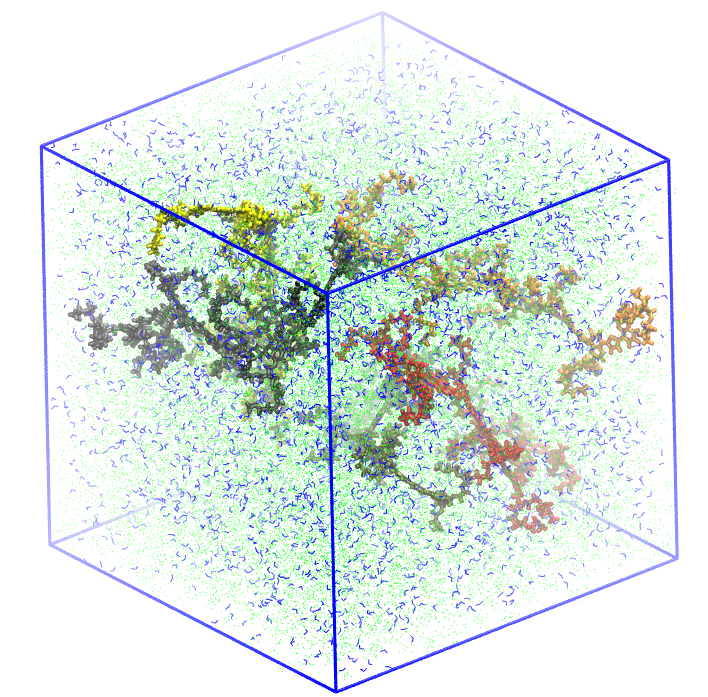
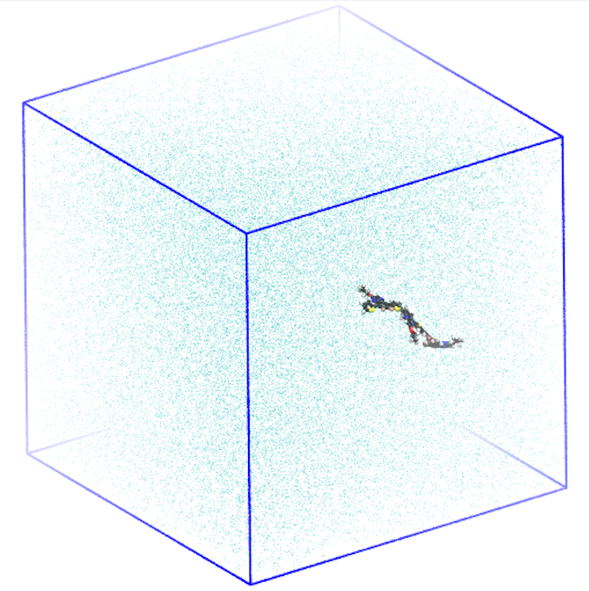
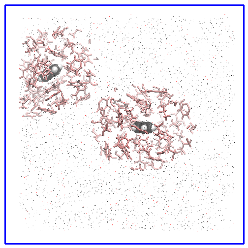

# Generating Gaussian input for QM/MM calculations

This tutorial is dedicated to create Gaussian input files for QM/MM calculations with `prep_qmmm.py` script. The document is separated in two parts, approaching single and multiple files with and without a cutoff for the embedding. 

## Multiple files with full box

For this part we have 5 snapshots extracted from a Molecular Dynamics (MD) simulation of 5 oligomers in a solution of ethanol and water. The snapshots are located in the `configs` directory and the topology files are `ethanol.itp`, `tip3p.itp` and `ff_olig.itp`, such that:

```
$ ls
configs     ethanol.itp ff_olig.itp tip3p.itp
```
```
$ ls configs/
conf1_box1_000.gro conf1_box1_001.gro conf1_box1_002.gro conf1_box1_003.gro conf1_box1_004.gro
```

For example, the `conf1_box1_000.gro` is the following:



The box has 5 oligomer chains (different colors) solvated in a mixture of ethanol (green points) and water (blue lines) molecules.  

Suppose we want to consider the 4 central backbone units of the red oligomer (resid 1 and residue names M4B, M5B, M6B and M7B) as the quantum region. To do so, we can identify the atom numbers as indexed in the `.gro` file or use the residues names and residue number/ID:

```
$ python $tools/prep_qmmm.py ethanol.itp tip3p.itp ff_olig.itp -res M4B M5B M6B M7B -rn 1 -k "M06/cc-pVDZ Charge NoSymm TD(NStates=25) SCF(XQC)" -dir configs
################################################
Working on configuration 'conf1_box1_004.gro'...
################################################

Selecting residue names ['M4B', 'M5B', 'M6B', 'M7B'] with residue numbers [1].

Gaussian input file 'input_files/input_conf1_box1_004.com' successfully created.

Atoms [101, 627, 657, 148, 118, 543, 572, 200, 230, 269] were removed and the charges were redistributed over the respective 3 closest point charges.

Total charge is -0.00407 due to numerical fluctuations.
Charge 0.00407 was added to the most distant partial charge in file 'neutral_*'.
The most distant partial charge is located at ('-61.450', '55.530', '78.530') AA and the smallest distance of it to any QM atom is 149.282 AA.

################################################
Working on configuration 'conf1_box1_003.gro'...
################################################

Selecting residue names ['M4B', 'M5B', 'M6B', 'M7B'] with residue numbers [1].

Gaussian input file 'input_files/input_conf1_box1_003.com' successfully created.

Atoms [101, 657, 627, 118, 148, 543, 572, 230, 200, 269] were removed and the charges were redistributed over the respective 3 closest point charges.

Total charge is -0.00407 due to numerical fluctuations.
Charge 0.00407 was added to the most distant partial charge in file 'neutral_*'.
The most distant partial charge is located at ('-60.230', '69.660', '76.440') AA and the smallest distance of it to any QM atom is 137.594 AA.

################################################
Working on configuration 'conf1_box1_002.gro'...
################################################

Selecting residue names ['M4B', 'M5B', 'M6B', 'M7B'] with residue numbers [1].

Gaussian input file 'input_files/input_conf1_box1_002.com' successfully created.

Atoms [101, 627, 657, 148, 118, 572, 543, 200, 230, 269] were removed and the charges were redistributed over the respective 3 closest point charges.

Total charge is -0.00407 due to numerical fluctuations.
Charge 0.00407 was added to the most distant partial charge in file 'neutral_*'.
The most distant partial charge is located at ('-0.440', '95.920', '3.180') AA and the smallest distance of it to any QM atom is 98.077 AA.

################################################
Working on configuration 'conf1_box1_000.gro'...
################################################

Selecting residue names ['M4B', 'M5B', 'M6B', 'M7B'] with residue numbers [1].

Gaussian input file 'input_files/input_conf1_box1_000.com' successfully created.

Atoms [101, 657, 627, 118, 148, 572, 543, 200, 230, 269] were removed and the charges were redistributed over the respective 3 closest point charges.

Total charge is -0.00407 due to numerical fluctuations.
Charge 0.00407 was added to the most distant partial charge in file 'neutral_*'.
The most distant partial charge is located at ('1.450', '92.800', '98.610') AA and the smallest distance of it to any QM atom is 101.776 AA.

################################################
Working on configuration 'conf1_box1_001.gro'...
################################################

Selecting residue names ['M4B', 'M5B', 'M6B', 'M7B'] with residue numbers [1].

Gaussian input file 'input_files/input_conf1_box1_001.com' successfully created.

Atoms [101, 657, 627, 118, 148, 543, 572, 230, 200, 269] were removed and the charges were redistributed over the respective 3 closest point charges.

Total charge is -0.00407 due to numerical fluctuations.
Charge 0.00407 was added to the most distant partial charge in file 'neutral_*'.
The most distant partial charge is located at ('-0.730', '0.420', '90.300') AA and the smallest distance of it to any QM atom is 99.744 AA.
```

For each configuration, two input files are placed at the `input_files` directory, with `input_` and `neutral_` prefixes:

```
$ ls
configs     ethanol.itp ff_olig.itp input_files tip3p.itp
```
```
$ ls input_files
input_conf1_box1_000.com   input_conf1_box1_003.com   neutral_conf1_box1_001.com neutral_conf1_box1_004.com
input_conf1_box1_001.com   input_conf1_box1_004.com   neutral_conf1_box1_002.com
input_conf1_box1_002.com   neutral_conf1_box1_000.com neutral_conf1_box1_003.com
```

The difference between files is that the `neutral_` prefix account for numerical fluctuations and redistribute it to the most distant partial charge. For example, -0.00407 was summed to the partial charge at ('-0.730', '0.420', '90.300') AA of the `conf1_box1_001.gro`:

```
$ diff input_files/input_conf1_box1_001.com input_files/neutral_conf1_box1_001.com
38906c38906
< -0.730	0.420	90.300	0.06000819248154717
---
> -0.730	0.420	90.300	0.06407485914946584
```

All atoms that were removed during the [H link-atom approach](https://doi.org/10.1002/anie.200802019) are indicated for each configuration, e.g., `[101, 657, 627, 118, 148, 543, 572, 230, 200, 269]` for `conf1_box1_001.gro`. The charge of the removed atoms are redistributed along the `-nn` closest neighbor point charges (which are 3 by default). 

To check the configuration one can set the `--test` flag to create a `.xyz` file with all partial charges described as bismuth atoms (represented as points in the figure below):



**_PS:_** When using the residue's name and number, be sure that residues are properly indexed before running the program. If not, use the atomic numbers to avoid problems. Additionally, also ensure that different atoms from same residue have different names in the `[ atoms ]` block from the topology file.

## Single file with cutoff radius for partial charges

For this part let's consider `box.gro`, a cubic box with 10 benzene, 500 water and 500 ethanol molecules. 

```
$ ls
benzene.itp box.gro     ethanol.itp    water.itp
```

Instead of including all other atoms as point charges, we can set a cutoff radius using the `-ec` flag and redistribute the charge among the percentage of most distant atoms set by the flag `-pc` (values between 0.0 and 1.0). Let's consider the quantum region as the 2 benzenes molecules with resid 1 and 2:

```
$ python $tools/prep_qmmm.py benzene.itp water.itp ethanol.itp -res UNK -rn 1 2 -k "B3LYP/STO-3G Charge NoSymm" -gro box.gro -ec 10
Selecting residue names ['UNK'] with residue numbers [1, 2].

Gaussian input file 'calc.com' successfully created.

Charge of -3.768300000000001 was redistributed over the 10.0% most distant point charges (113) from the QM region.

Total charge is 0.00000. No need for fixing numerical fluctuations.
```

In this case the `-gro` flag indicates the single file `box.gro`, `-chk` includes the checkpoint line in the input file and `-ec 10` set the cutoff distance as 10 Angstrom. Since we didn't specify the `-pr` flag, the default value will equally redistribute the net charge over the 10% most distant atoms, which in this case, corresponds to around -0.0038 per atom. To visualize the system, we can run:

```
$ python $tools/prep_qmmm.py benzene.itp water.itp ethanol.itp -res UNK -rn 1 2 -k "B3LYP/STO-3G Charge NoSymm" -gro box.gro -ec 10 --test
Selecting residue names ['UNK'] with residue numbers [1, 2].

Gaussian input file 'calc.xyz' sucessfully created.

No partial charges when --test is set.
```

For comparison, we can open the configuration on [VMD](https://www.ks.uiuc.edu/Research/vmd/minitutorials/tachyonao/) with the original box:



All atoms from the original boxes are represented as points, while the quantum regions are vdW spheres and the classical embedding is shown as dynamical bonds. As the current version does not include periodic boundary conditions, one should ensure that there are enough classical atoms up to the desired radius cutoff. For example, one can run `gmx trjconv -f box.gro -s box.gro -o box_centered.gro -center` and choose a specific group to be centered.